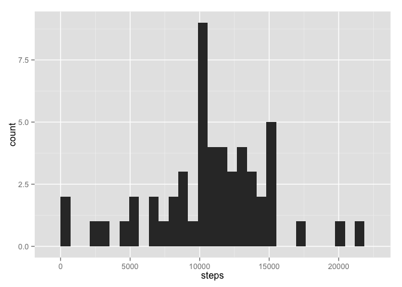

# Reproducible Research: Peer Assessment 1

## Dependencies

Load the ggplot library

```r
library(ggplot2)
library(lattice)
```

## Loading and preprocessing the data

First to load the data we need to unzip the data


```r
unzip('./activity.zip')
```

Now the data can be loaded and be transformed. Convert the data field to actual POSIXlt data.


```r
activity <- read.csv('./activity.csv')
activity$date <- as.Date(activity$date, '%Y-%m-%d')
```

## What is mean total number of steps taken per day?

Use the aggregate function to sum the steps taken per day removing the NA values.


```r
steps_per_day <- aggregate(steps ~ date, activity, sum, na.rm=TRUE )
```

Now calculate the **mean** the the **median** of all the steps taken by day


```r
daily_mean_steps <- mean(steps_per_day$steps)
daily_mean_steps # print the mean per day
```

```
## [1] 10766.19
```


```r
daily_median_steps <- median(steps_per_day$steps)
daily_median_steps # print the median per day
```

```
## [1] 10765
```

Now makes an histogram of the steps taken per day.

```r
qplot(steps, data=steps_per_day, geom = 'histogram')
```

 

## What is the average daily activity pattern?

Plot a time series of the averange daily activity

```r
mean_steps_interval <- aggregate(steps ~ interval, activity, mean, na.rm=TRUE)
qplot(x = interval, y=steps, data = mean_steps_interval, geom='line')
```

 

Which 5-minute interval contains the maximum number of steps.

```r
max_steps_interval_idx <- which.max(mean_steps_interval$steps)
mean_steps_interval[max_steps_interval_idx,]$interval
```

```
## [1] 835
```

## Imputing missing values

Number of missing values 


```r
which_na <- is.na(activity$steps)
nrow(activity[which_na,])
```

```
## [1] 2304
```

Now lets create a new dataset with the missing values filled by the **averange of steps taken per interval**


```r
filled_activity <- activity
for(i in 1:nrow(filled_activity)) {
  if(which_na[i]) {
    activity_interval <- filled_activity[i, ]$interval
    average_steps_by_interval <- mean_steps_interval[mean_steps_interval$interval == activity_interval, ]$steps
    filled_activity[i, ]$steps <- average_steps_by_interval
  }
}
```

Make a histogram of the number of steps taken each day


```r
filled_steps_per_day <- aggregate(steps ~ date, filled_activity, sum)
qplot(steps, data=filled_steps_per_day, geom='histogram')
```

 

Calculate the **mean** of steps per day


```r
filled_daily_mean_steps <- mean(filled_steps_per_day$steps)
filled_daily_mean_steps # print the mean per day
```

```
## [1] 10766.19
```


Calculate the **median** of steps per day


```r
filled_daily_median_steps <- median(filled_steps_per_day$steps)
filled_daily_median_steps # print the median per day
```

```
## [1] 10766.19
```

while the **mean** value does not differ from the original dataset, the **median** value does differ. Being identical to the mean one. This is due the strategy that we`ve taken. Thus is safe to say that the orignal dataset may not be biased due the *na* values.

## Are there differences in activity patterns between weekdays and weekends?

Create a factor with a new collumn that indicates if the date is a weekend or a weekday


```r
filled_activity$day <- as.POSIXlt(filled_activity$date)$wday
filled_activity$day <- factor(ifelse(filled_activity$day == 6 | filled_activity$day == 0, 'weekend', 'weekday'))
```

Plot the 5-minute interval and the average steps taken by *weekend* and by *weekdays*.


```r
mean_steps_interval_day <- aggregate(steps ~ interval + day, data = filled_activity, mean)

xyplot(steps ~ interval | day, data = mean_steps_interval_day, layout = c(1, 2), type="l")
```

 

